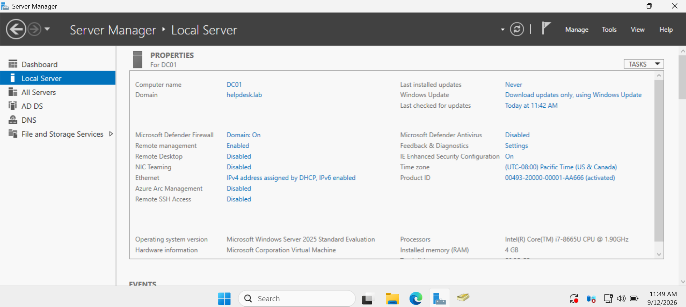
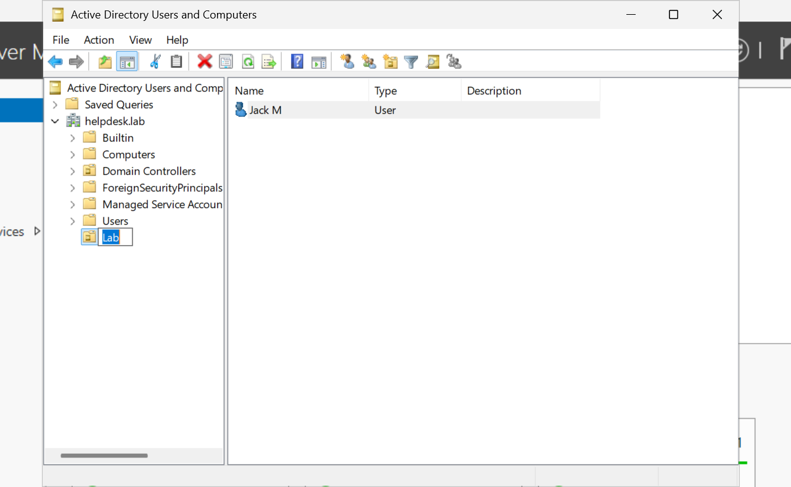
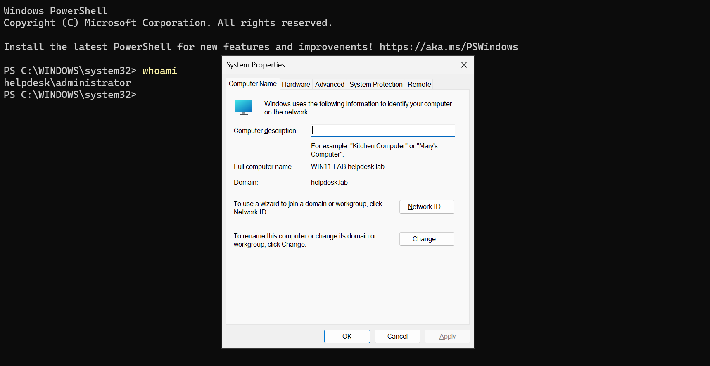
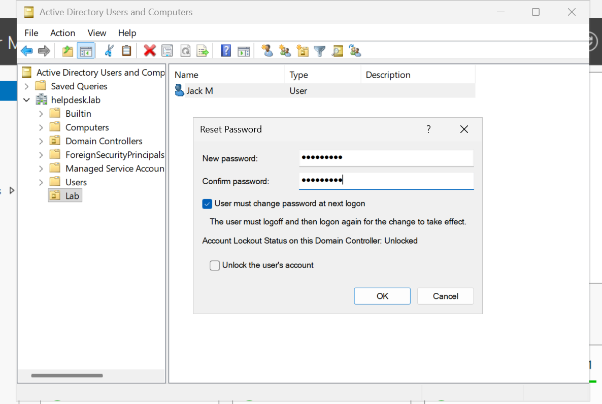
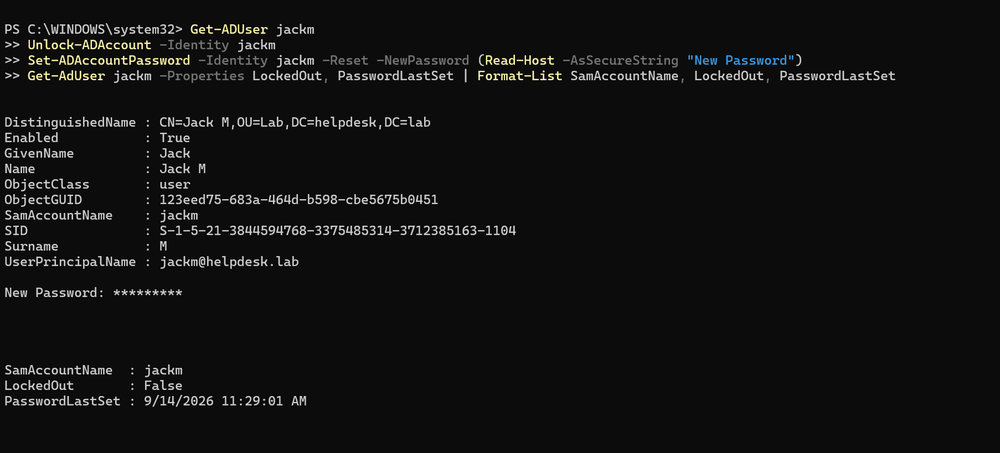

# Windows Help Desk Lab

Hyper-V lab for desktop / help desk work: Active Directory on Windows Server 2025 and Windows 11 client

## Environment

| Role | Name |
|---|---|
| Forest / domain | `helpdesk.lab` |
| Domain controller | `DC01` |
| Client | `WIN11-LAB` | 
| OU | `Lab` |
| Test user | `jackm` |

Host Hyper-V -> Default Switch -> DC01 + WIN11-LAB
WIN11 DNS -> DC01

## What I performed

- Promote a server to a domain controller and create a forest
- Join a workstation to the domain
- Creat an Organization Unit (OU) and user
- Reset / unlock a password in ADUC and PowerShell

## Screenshots

## Script

`powershell/Reset_LabUserPassword.ps1` - unlock + reset + verify user. Run on DC01 as a domain admin